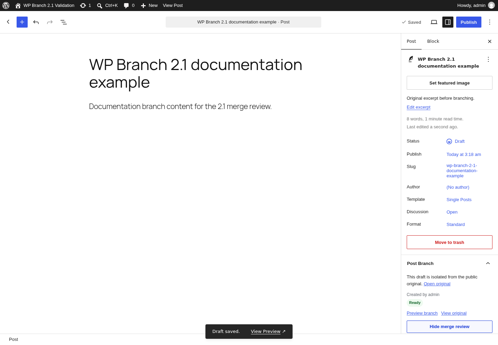
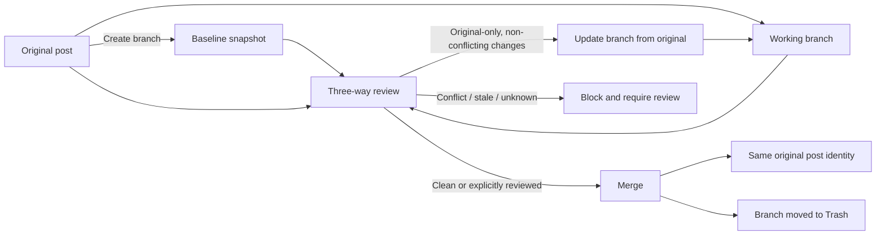
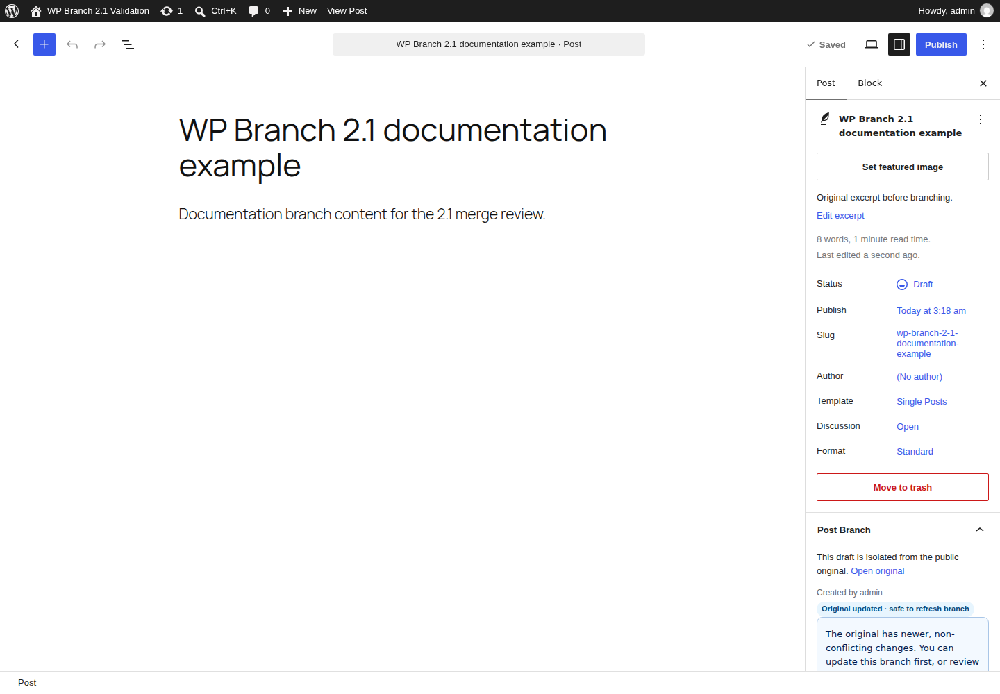
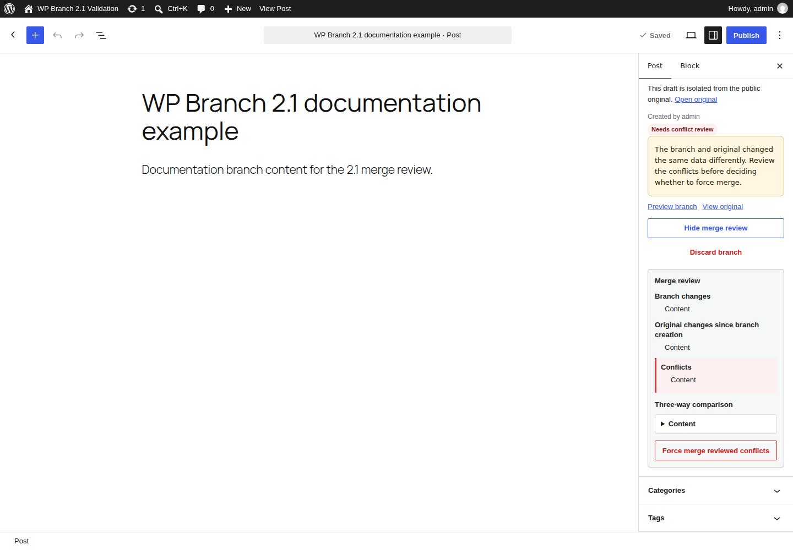
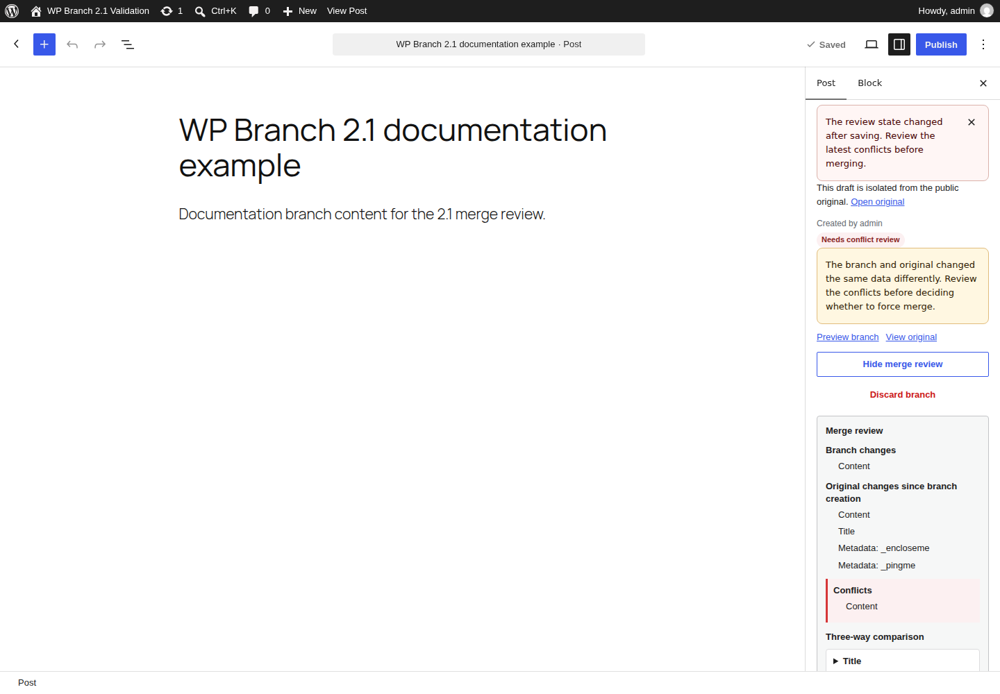

# WP Branches For Post

**Git-like editorial branching for WordPress content — with three-way review, conflict protection, and release-grade validation.**

[](https://github.com/hsxk/WP-Branches-For-Post/actions/workflows/ci.yml)
[](https://github.com/hsxk/WP-Branches-For-Post/actions/workflows/compatibility.yml)
[](https://github.com/hsxk/WP-Branches-For-Post/actions/workflows/visual-regression.yml)
[](https://github.com/hsxk/WP-Branches-For-Post/releases/latest)
[](https://wordpress.org/plugins/wp-branches-for-post/)
[](./LICENSE)

WP Branches For Post lets editors create an isolated working branch from an existing WordPress post, page, or supported custom post type, edit without changing the public original, review the difference against a saved baseline, and merge safely when the work is ready.

Version **2.1.0** turns the plugin into a true three-way editorial workflow rather than a simple duplicate-and-replace tool.

<p align="center">
  
</p>

## Why this project exists

WordPress revisions are excellent for recovering history, but they do not provide a long-lived editing branch that can evolve independently while the live post continues to change.

This plugin models the problem explicitly:

- **Original** — the canonical post that keeps its identity, URL, status, author, and publication history.
- **Baseline** — the state captured when the branch is created or safely updated.
- **Branch** — the isolated working copy where editorial changes are made.
- **Review** — a three-way comparison that separates branch-only changes, original-only changes, and real conflicts.

The result is an editorial workflow closer to source control, while still using normal WordPress posts, permissions, metadata, taxonomies, and editors.

## What 2.1.0 can do

- Create an isolated draft branch from published, private, or scheduled content.
- Review **Base / Original / Branch** before merging.
- Distinguish safe original-only changes from true conflicts.
- Update a branch from the original when newer changes do not conflict.
- Block stale reviews with a reviewed-state token.
- Re-check state during merge so a race cannot silently overwrite newer work.
- Preserve post identity fields instead of replacing the original object.
- Roll the original back if post-merge cleanup fails.
- Support Gutenberg, Classic Editor, post-list row actions, and the admin bar.
- Preserve and merge public metadata, multi-value metadata, featured images, and taxonomies.
- Support compatible custom post types.
- Warn when synchronized patterns can affect content outside the branch.
- Fail conservatively for legacy, unknown, or missing-original states.

## Merge model



The original post remains the canonical object throughout the workflow. A merge updates allowed editorial data; it does not replace the original post with the branch.

## Safety invariants

The merge path is deliberately defensive.

1. **Authorization is never bypassed.** Force merge can resolve an accepted content conflict, but cannot bypass capability, nonce, or branch/original relationship checks.
2. **Identity stays with the original.** IDs, slugs, author, status, publication dates, hierarchy, and other protected identity fields are not blindly copied from the branch.
3. **Reviewed state must still be current.** REST status exposes a review token derived from the complete merge state; stale tokens are rejected.
4. **Race conditions fail closed.** The service validates state again after analysis and before applying the merge.
5. **Merge cleanup is transactional in spirit.** The original is snapshotted before write; if branch cleanup fails, the original is restored and the branch remains active.
6. **Internal relationship metadata never leaks.** Branch bookkeeping is isolated from user content metadata.
7. **Unknown states are not treated as safe.** Legacy or incomplete data routes the user back through explicit review.

See [ARCHITECTURE.md](./ARCHITECTURE.md) and [SECURITY.md](./SECURITY.md) for the implementation model and trust boundaries.

## Validation depth

The 2.1.0 release was promoted only after the same candidate passed the following gates:

| Layer | Release validation |
| --- | --- |
| Real WordPress service/integration suite | **104 / 104 checks** |
| Real Chromium + Gutenberg E2E | **33 / 33 checks** |
| Semantic UI/tutorial coverage | **35 / 35 cases** |
| WordPress compatibility | **6.6 + 7.1.1** |
| PHP compatibility | **8.2 / 8.3 / 8.4** |
| Static quality | PHP syntax, WordPress Coding Standards, JS lint, CSS lint |
| Build integrity | deterministic editor build + committed-build verification |
| Translations | deterministic POT/PO/MO/editor JSON regeneration |
| Repository readiness | WordPress Plugin Check |
| Packaging | actual release ZIP allow/deny audit |
| Release UI evidence | 12 WordPress.org screenshots + 35-case visual library |

The public repository runs these checks on pull requests and on `master`, using standard GitHub-hosted runners.

### Visual contract

The visual suite does not merely check that PNG files exist. Each case navigates a real WordPress installation and requires the expected UI state to be visible before the evidence image is captured.

Examples include:

- conflict summary and three-way detail;
- stale-review rejection;
- missing-original and legacy/unknown states;
- private and scheduled originals;
- Classic Editor safe merge and conflict handling;
- post-list/admin-bar integrations;
- custom post types;
- taxonomy, metadata, and featured-image review.

Browse the complete [35-case tutorial evidence library](./docs/tutorial-2.1/README.md).

## Screenshots

### Update available after the original changes



### Conflict protection



### Stale review protection



## Compatibility

- WordPress **6.6+**
- Tested through WordPress **7.1**
- PHP **8.2+**
- Block Editor / Gutenberg
- Classic Editor integration
- Posts, pages, and compatible custom post types

## Install

### From WordPress.org

Install **WP Branches For Post** from the WordPress plugin directory:

https://wordpress.org/plugins/wp-branches-for-post/

### From a GitHub release

Download the audited plugin ZIP from:

https://github.com/hsxk/WP-Branches-For-Post/releases/latest

## Development

```bash
npm ci
composer install

npm run lint:js
npm run lint:css
npm run build
composer run lint
npm run plugin-zip
```

The repository also contains real-WordPress and browser suites used by GitHub Actions. See [TESTING.md](./TESTING.md) for the validation strategy and test surfaces.

## Repository map

| Path | Purpose |
| --- | --- |
| `includes/` | branch, sync, merge, REST, plugin, and admin services |
| `src/` | Block Editor integration source |
| `build/` | committed production editor bundle |
| `languages/` | POT/PO/MO and editor translation artifacts |
| `tests/` | real WordPress, browser E2E, screenshot, and tutorial contracts |
| `docs/tutorial-2.1/` | exhaustive 2.1 workflow evidence |
| `.wordpress-org/` | plugin-directory screenshots and assets |
| `.github/workflows/` | CI, compatibility, visual regression, and gated release automation |

## Release engineering

A version tag is not enough to publish this plugin.

The release workflow calls the same quality, compatibility, and browser/visual workflows used on pull requests, verifies that the tag matches the plugin header, constant, `README.txt` stable tag, and package version, audits the generated ZIP, runs Plugin Check, and only then permits the WordPress.org deployment job.

That makes the public release artifact the output of a reproducible validation pipeline rather than a manually assembled ZIP.

## Documentation

- [WordPress.org readme](./README.txt)
- [Architecture](./ARCHITECTURE.md)
- [Security model](./SECURITY.md)
- [Testing strategy](./TESTING.md)
- [Contributing](./CONTRIBUTING.md)
- [2.1 tutorial and 35-case evidence](./docs/tutorial-2.1/README.md)

## Contributing

Contributions are welcome. Please read [CONTRIBUTING.md](./CONTRIBUTING.md) before opening a pull request.

Security-sensitive changes should follow the guidance in [SECURITY.md](./SECURITY.md).

## License

GPL-3.0-or-later. See [LICENSE](./LICENSE).

---

Maintained by **Hao Kexin** — [time2log.com](https://time2log.com/about/)
